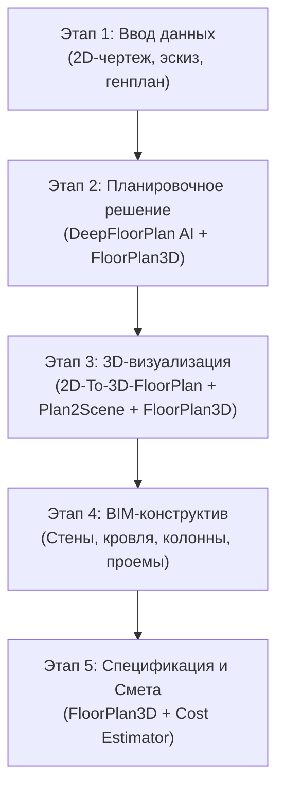

# 🏗️ Флагман (Цех Керчь) — Интеллектуальная BIM & 3D Платформа

> **Инновационная веб-система проектирования, 3D-визуализации и автоматического сметного расчета гибридных домов и генеральных планов участков на базе ИИ.**

---

## 📌 Оглавление
1. [Обзор проекта](#-обзор-проекта)
2. [5 этапов работы платформы и интеграция ИИ-модулей](#-5-этапов-работы-платформы-и-интеграция-ии-модулей)
   - [Этап 1: Предпроектный анализ и ввод данных](#этап-1-предпроектный-анализ-и-ввод-данных)
   - [Этап 2: Планировочное решение (DeepFloorPlan & FloorPlan3D)](#этап-2-планировочное-решение-deepfloorplan--floorplan3d)
   - [Этап 3: 3D-визуализация (2D-To-3D-FloorPlan, Plan2Scene & FloorPlan3D)](#этап-3-3d-визуализация-2d-to-3d-floorplan-plan2scene--floorplan3d)
   - [Этап 4: Инженерное BIM-моделирование и конструкция кровли](#этап-4-инженерное-bim-моделирование-и-конструкция-кровли)
   - [Этап 5: Спецификация и автоматическая смета (FloorPlan3D & Cost Estimator)](#этап-5-спецификация-и-автоматическая-смета-floorplan3d--cost-estimator)
3. [Роль и архитектура ключевых нейросетевых модулей](#-роль-и-архитектура-ключевых-нейросетевых-модулей)
4. [Технологический стек](#-технологический-стек)
5. [Структура репозитория](#-структура-репозитория)
6. [Установка и локальный запуск](#-установка-и-локальный-запуск)

---

## 🌟 Обзор проекта

Проект **«Флагман» (Цех Керчь)** представляет собой сквозную платформу для автоматизации проектирования и продажи загородных домов, банных комплексов и благоустройства участков. 

Платформа позволяет загрузить любое изображение (эскиз от руки, планировку БТИ, чертеж из интернета или генеральный план участка) и за один клик сгенерировать интерактивную **фотореалистичную 3D-BIM модель** с многоскатными крышами, несущими колоннами, фасадами, меблировкой, сантехникой, ландшафтом и **готовой строительной сметой**.

---

## 🔄 5 этапов работы платформы и интеграция ИИ-модулей

В основе работы кнопки **«Собрать 3D-дом & Смета»** лежит строгий пятиэтапный конвейер. Ниже подробно описано, где именно задействован каждый модуль:



---

### Этап 1: Предпроектный анализ и ввод данных
* **Что происходит:** Пользователь загружает изображение планировки (JPG/PNG), выбирает параметры отделки (фасадная штукатурка, дерево, клинкерный кирпич, плинтусы, карнизы).
* **Модули:** `UniversalFloorplanImporter`, оптическая нормализация масштаба и очистка шума.

---

### Этап 2: Планировочное решение
> 🎯 **Здесь работают:** `FloorPlan3D` и `DeepFloorPlan`

* **Функционал:**
  * **`DeepFloorPlan AI`:** Выполняет семантическую сегментацию изображения. Распознает несущие и межкомнатные стены, координаты углов и дверных/оконных проемов, строит топологический граф комнат (`GraphRoom`).
  * **`FloorPlan3D`:** Анализирует геометрию и функциональное назначение помещений (гостиная, спальня, кухня, парная, терраса, беседка, бассейн, парковка) и формирует логические зоны расстановки оборудования.
* **Результат:** Точный математический граф планировки и взаимного расположения объектов на участке.

---

### Этап 3: 3D-визуализация
> 🎯 **Здесь работают:** `2D-To-3D-FloorPlan`, `Plan2Scene` и `FloorPlan3D`

* **Функционал:**
  * **`2D-To-3D-FloorPlan`:** Выполняет геометрическую экструзию 2D-графа в полноценные 3D-объемы стен (`WallNode`), пробивает проемы для окон (`WindowNode`) и дверей (`DoorNode`), возводит фундаментные плиты (`SlabNode`).
  * **`Plan2Scene`:** Отвечает за физически корректный (PBR) синтез материалов отделки экстерьера и интерьера:
    * **Главный дом:** Белоснежная штукатурка (`preset-softwhite`).
    * **Баня:** Натуральный золотистый брус сосны (`preset-ochre`).
    * **Хозблок и санузел:** Клинкерный кирпич (`preset-brickred`).
    * **Беседка и ограждения:** Благородный темный дуб (`preset-espresso`).
    * **Ландшафт:** Сочный зеленый газон (`preset-forest`), вода бассейна (`preset-sky`) и мощение парковки (`preset-charcoal`).
  * **`FloorPlan3D`:** Автоматически наполняет сцену 3D-моделями (`ItemNode`) из локальной библиотеки (145+ GLB-моделей): диваны, кухни, сантехника, купели, шезлонги, зонты, автомобиль Tesla, лиственные и хвойные деревья, пальмы.
* **Результат:** Интерактивная 3D-сцена с возможностью свободного перемещения камеры от первого/третьего лица.

---

### Этап 4: Инженерное BIM-моделирование и конструкция кровли
* **Функционал:**
  * Генерация скатных и вальмовых крыш (`RoofNode`, `RoofSegmentNode`) с динамическим расчетом уклона, свесов и коньков.
  * Установка несущих деревянных опор и колонн (`ColumnNode`) для беседок и открытых террас.
  * Формирование плинтусов (`skirting`), карнизов (`crown`) и декоративных молдингов.

---

### Этап 5: Спецификация и автоматическая смета
> 🎯 **Здесь работают:** `FloorPlan3D` (аналитический слой) и `Plugin Cost Estimator`

* **Функционал:**
  * **`FloorPlan3D`:** Производит точный расчет чистых площадей комнат, периметра стен, высотных отметок и объемов зон.
  * **`Cost Estimator`:** На основе геометрии 3D-сцены автоматически вычисляет:
    * Объем бетона фундамента ($м^3$).
    * Площадь кладки стен и фасадной отделки ($м^2$).
    * Площадь кровельного покрытия и водосточной системы ($м^2$).
    * Погонные метры плинтусов и молдингов ($м.п.$).
    * Спецификацию и стоимость установленных 3D-моделей и оборудования.
* **Результат:** Детализированная ведомость объемов работ и итоговая коммерческая смета строительства.

---

## 🧠 Роль и архитектура ключевых нейросетевых модулей

| Модуль | Файлы реализации | Назначение |
| :--- | :--- | :--- |
| **DeepFloorPlan AI** | `lib/deepfloorplan-engine.ts`<br/>`lib/ai-floorplan-graph-vectorizer.ts` | Распознавание растровых чертежей, поиск контуров стен, дверей и сегментация помещений в единый топологический граф. |
| **2D-To-3D-FloorPlan** | `lib/nim-scene-builder.ts`<br/>`lib/floorplan-layout-generator.ts` | Преобразование 2D-графа в трехмерный параметрический каркас зданий и мастер-плана участка. |
| **Plan2Scene** | `packages/core/src/material-library.ts`<br/>`packages/viewer/src/systems/wall/wall-materials.ts` | Генерация реалистичных PBR-материалов (штукатурка, дерево, кирпич, плитка, газон, вода, металл). |
| **FloorPlan3D** | `lib/furniture-synthesizer.ts`<br/>`packages/nodes/src/item/renderer.tsx` | Интеллектуальная расстановка мебели, сантехники, ландшафта и расчет геометрических параметров для сметы. |

---

## 💻 Технологический стек

* **Frontend:** React 19, TypeScript, Vite, Tailwind CSS v4, Lucide Icons.
* **3D & BIM Engine:** Three.js (WebGPU / WebGL2), React Three Fiber (`@react-three/fiber`), Drei (`@react-three/drei`), BVH ускорение raycasting.
* **Core BIM Schema:** Pascal BIM Architecture (`@pascal-app/core`, `@pascal-app/nodes`, `@pascal-app/viewer`, `@pascal-app/editor`).
* **Ассеты и 3D-модели:** Локальный каталог оптимизированных `.glb` моделей и физических PBR-материалов.

---

## 📁 Структура репозитория

```
├── 3d-editor/                   # Ядро 3D BIM редактора (Monorepo)
│   ├── apps/
│   │   └── editor/              # Приложение 3D-редактора (Next.js / Turbopack)
│   │       ├── components/      # UI компоненты, модалка генерации чертежей
│   │       ├── lib/             # Алгоритмы ИИ (DeepFloorPlan, Plan2Scene, FloorPlan3D)
│   │       └── public/items/    # Локальная библиотека 145+ 3D-моделей GLB
│   └── packages/
│       ├── core/                # Схемы узлов (WallNode, RoofNode, ItemNode, ColumnNode)
│       ├── nodes/               # Рендереры и параметрические генераторы нод
│       ├── viewer/              # WebGPU вьювер, система материалов и постобработки
│       └── plugin-cost-estimator/ # Модуль автоматического расчета сметы
├── src/                         # Основной лендинг и личный кабинет клиента
│   ├── components/              # Виджеты, калькуляторы, модальные окна
│   └── App.tsx                  # Главная страница платформы «Флагман»
├── dist/                        # Скомпилированный продакшн бандл
├── package.json                 # Корневой манипулятор скриптов запуска
└── README.md                    # Документация проекта
```

---

## 🚀 Установка и локальный запуск

### 1. Требования
* Node.js $\ge 18.0.0$
* npm $\ge 9.0.0$

### 2. Установка зависимостей
```bash
npm install
cd 3d-editor && npm install
cd ..
```

### 3. Запуск режима разработки (Dev)
Команда запускает одновременно основной лендинг (порт `3000`) и 3D BIM-редактор (порт `3002`):
```bash
npm run dev
```

* **Лендинг и каталог:** [http://localhost:3000](http://localhost:3000)
* **3D-редактор:** [http://localhost:3002](http://localhost:3002)

### 4. Сборка продакшн-версии (Build)
```bash
npm run build
```

---

*Разработано для платформы «Флагман / Цех Керчь» — Инженерия современных гибридных домов.*
